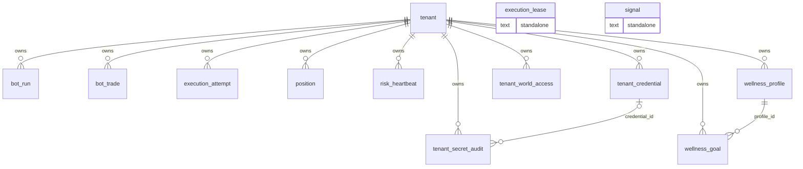

# Data model

**Generated from the live schema by `tools/gen_data_model.py`.** Do not
edit by hand -- re-run it after a migration and the shape follows the
database instead of drifting from it.

SQLite, one schema, 13 tables. Every tenant-owned table
carries a `tenant_id` foreign key that is NOT NULL, so a row without an
owner cannot be written even by a raw INSERT.

## Why one schema

Schema-per-tenant and schema-per-world were both rejected in Phase 0.
The deciding argument was not the arithmetic but the onboarding
contract: adding a customer must cost zero deploys and zero DDL, and
every alternative makes it a migration. SQLite reinforces it -- there is
no `CREATE SCHEMA`, and the nearest equivalent means a file per world
with foreign keys the database will not enforce.

## Entity relationships

`signal` and `execution_lease` stand alone deliberately. Signals are
market data with no owner; a lease is transient bookkeeping whose key
already carries the tenant.

## tenancy

### `tenant`

One operator. There is no organisation above this: Phase 0 proved it from four directions -- no tenant column in the old user table, one credential folder per person, one password beside those credentials, and world access keyed by username.

| column | type | null | notes |
| --- | --- | --- | --- |
| `id` | VARCHAR(36) | no | **PK** |
| `slug` | VARCHAR(64) | no | unique · the username; the natural key, and what the wellness profile's uniqueness is expressed through |
| `display_name` | VARCHAR(128) | no |  |
| `email` | VARCHAR(255) | yes | unique |
| `status` | VARCHAR(16) | no |  |
| `is_admin` | BOOLEAN | no |  |
| `password_hash` | VARCHAR(255) | no | Argon2id, never reversible. A venue key must be decrypted because it is presented to a venue; a password only needs comparing. |
| `password_algo` | VARCHAR(32) | no |  |
| `password_updated_at` | DATETIME | yes |  |
| `created_at` | DATETIME | no |  |
| `updated_at` | DATETIME | no |  |

**Unique:** `(email)`, `(slug)`

**Checks:** `ck_tenant_slug_not_blank`, `ck_tenant_status_known`

### `tenant_credential` · tenant-scoped

A venue credential, envelope-encrypted. Reversible on purpose, unlike the password: the system has to present it to Tradier or Kalshi.

| column | type | null | notes |
| --- | --- | --- | --- |
| `id` | VARCHAR(36) | no | **PK** |
| `tenant_id` | VARCHAR(36) | no | FK → `tenant` |
| `venue` | VARCHAR(32) | no |  |
| `label` | VARCHAR(64) | no |  |
| `ciphertext` | BLOB | no |  |
| `wrapped_dek` | BLOB | no | the per-record data key, itself encrypted by the master key |
| `nonce` | BLOB | no |  |
| `key_version` | INTEGER | no | which master key wrapped this record; what makes a re-key possible |
| `created_by` | VARCHAR(64) | yes |  |
| `rotated_at` | DATETIME | yes |  |
| `rotated_by` | VARCHAR(64) | yes |  |
| `revoked_at` | DATETIME | yes |  |
| `created_at` | DATETIME | no |  |
| `updated_at` | DATETIME | no |  |

**Unique:** `(tenant_id, venue, label)`

**Checks:** `ck_tenant_credential_venue_known`

**Indexes:** `ix_tenant_credential_tenant_id`

### `tenant_secret_audit` · tenant-scoped

The one audit table, and it exists because the brief requires recording who changed a credential -- not because audit tables are good practice in the abstract.

| column | type | null | notes |
| --- | --- | --- | --- |
| `id` | INTEGER | no | **PK** |
| `tenant_id` | VARCHAR(36) | no | FK → `tenant` |
| `credential_id` | VARCHAR(36) | yes | FK → `tenant_credential` |
| `action` | VARCHAR(16) | no |  |
| `actor` | VARCHAR(64) | no |  |
| `at` | DATETIME | no |  |

**Checks:** `ck_tenant_secret_audit_action_known`

**Indexes:** `ix_tenant_secret_audit_tenant_id`

### `tenant_world_access` · tenant-scoped

Which tiles an operator may open. Replaces worlds.json -- a file edit per operator failed the customer onboarding contract.

| column | type | null | notes |
| --- | --- | --- | --- |
| `id` | VARCHAR(36) | no | **PK** |
| `tenant_id` | VARCHAR(36) | no | FK → `tenant` |
| `world_key` | VARCHAR(32) | no |  |
| `enabled` | BOOLEAN | no |  |
| `is_default` | BOOLEAN | no |  |
| `created_at` | DATETIME | no |  |
| `updated_at` | DATETIME | no |  |

**Unique:** `(tenant_id, world_key)`

**Indexes:** `ix_tenant_world_access_tenant_id`

### `wellness_goal` · tenant-scoped

A child table rather than a JSON array, because the value is genuinely multi-valued and a blob would make 'add a goal' a read-modify-write.

| column | type | null | notes |
| --- | --- | --- | --- |
| `id` | INTEGER | no | **PK** |
| `tenant_id` | VARCHAR(36) | no | FK → `tenant` |
| `profile_id` | VARCHAR(36) | no | FK → `wellness_profile` |
| `goal` | VARCHAR(64) | no |  |
| `position` | INTEGER | no |  |

**Unique:** `(profile_id, position)`

**Indexes:** `ix_wellness_goal_tenant_id`

### `wellness_profile` · tenant-scoped

Special-category personal data. UNIQUE on tenant_id: the username is the unique id, expressed through the tenant rather than duplicated as a string, so a rename moves the profile instead of orphaning it.

| column | type | null | notes |
| --- | --- | --- | --- |
| `id` | VARCHAR(36) | no | **PK** |
| `tenant_id` | VARCHAR(36) | no | FK → `tenant` · unique |
| `gender` | VARCHAR(32) | yes |  |
| `age_band` | VARCHAR(16) | yes | a BAND ("35-44"), never a number. Named so nobody types it INTEGER. |
| `ethnicity` | VARCHAR(64) | yes |  |
| `diet` | VARCHAR(64) | yes |  |
| `style` | VARCHAR(32) | yes |  |
| `region` | VARCHAR(64) | yes |  |
| `notifications` | BOOLEAN | no |  |
| `created_at` | DATETIME | no |  |
| `updated_at` | DATETIME | no |  |

**Unique:** `(tenant_id)`

## trading

### `execution_attempt` · tenant-scoped

What makes a duplicate order impossible to EXPRESS rather than unlikely. The row is written before the venue is called; a repeat submit hits the uniqueness constraint and returns the first outcome.

| column | type | null | notes |
| --- | --- | --- | --- |
| `id` | VARCHAR(36) | no | **PK** |
| `tenant_id` | VARCHAR(36) | no | FK → `tenant` |
| `idempotency_key` | VARCHAR(128) | no | UNIQUE per tenant. A global key space would let one operator's retry return another's order. |
| `request_fingerprint` | VARCHAR(64) | no |  |
| `intent` | VARCHAR(24) | no |  |
| `status` | VARCHAR(16) | no |  |
| `position_id` | INTEGER | yes |  |
| `venue_order_id` | VARCHAR(64) | yes |  |
| `response_json` | TEXT | yes |  |
| `completed_at` | DATETIME | yes |  |
| `created_at` | DATETIME | no |  |
| `updated_at` | DATETIME | no |  |

**Unique:** `(tenant_id, idempotency_key)`, `(tenant_id, request_fingerprint)`

**Checks:** `ck_execution_attempt_status_known`, `ck_execution_attempt_intent_known`

**Indexes:** `ix_execution_attempt_tenant_id`

### `execution_lease`

A mutex that holds across processes. The primary key IS the mutex -- two processes inserting the same key cannot both succeed. An in-process lock does not span workers, and two have run on this machine.

| column | type | null | notes |
| --- | --- | --- | --- |
| `resource_key` | VARCHAR(160) | no | **PK** |
| `tenant_id` | VARCHAR(36) | no |  |
| `holder` | VARCHAR(64) | no |  |
| `acquired_at` | DATETIME | no |  |
| `expires_at` | DATETIME | no |  |

### `position` · tenant-scoped

An options position and both its exits.

| column | type | null | notes |
| --- | --- | --- | --- |
| `id` | INTEGER | no | **PK** |
| `tenant_id` | VARCHAR(36) | no | FK → `tenant` |
| `venue_sandbox` | BOOLEAN | no |  |
| `underlying` | VARCHAR(16) | no |  |
| `occ_symbol` | VARCHAR(32) | no |  |
| `option_type` | VARCHAR(4) | no |  |
| `strike` | FLOAT | no |  |
| `expiration` | VARCHAR(10) | no |  |
| `delta_at_entry` | FLOAT | yes | SIGNED. A call's delta runs 0..+1 and a put's 0..-1; storing the magnitude recorded every put as positive. |
| `contracts` | INTEGER | no |  |
| `buy_pct` | FLOAT | no |  |
| `tolerance_pct` | FLOAT | no |  |
| `entry_price` | FLOAT | yes |  |
| `tp_pct` | FLOAT | no |  |
| `sl_pct` | FLOAT | no |  |
| `tp_price` | FLOAT | yes |  |
| `sl_price` | FLOAT | yes |  |
| `buy_order_id` | VARCHAR(64) | yes |  |
| `tp_order_id` | VARCHAR(64) | yes |  |
| `stop_order_id` | VARCHAR(64) | yes | the stop that rests AT THE VENUE, so it survives this process dying |
| `stop_protection` | VARCHAR(16) | no | says out loud whether the stop survives a crash: venue_resting or monitored_only |
| `status` | VARCHAR(16) | no |  |
| `strategy` | VARCHAR(64) | no |  |
| `needs_review` | BOOLEAN | no |  |
| `opened_at` | DATETIME | yes |  |
| `closed_at` | DATETIME | yes |  |
| `exit_price` | FLOAT | yes |  |
| `pnl_usd` | FLOAT | yes | derived, but stored: the ledger sorts and aggregates on it (deliberate denormalisation) |
| `note` | TEXT | yes |  |
| `created_at` | DATETIME | no |  |
| `updated_at` | DATETIME | no |  |

**Checks:** `ck_position_status_known`, `ck_position_tp_positive`, `ck_position_stop_protection_known`, `ck_position_option_type_known`, `ck_position_sl_in_range`, `ck_position_contracts_positive`

**Indexes:** `ix_position_tenant_id`, `ix_position_tenant_status`, `ix_position_tenant_symbol_status`

### `risk_heartbeat` · tenant-scoped

The stop-loss's own watchdog. A stop that exists only inside a running loop is not a risk control, so the order path refuses new entries when this goes stale.

| column | type | null | notes |
| --- | --- | --- | --- |
| `tenant_id` | VARCHAR(36) | no | **PK** · FK → `tenant` |
| `last_pass_at` | DATETIME | yes |  |
| `last_ok_at` | DATETIME | yes |  |
| `consecutive_failures` | INTEGER | no |  |
| `last_error` | TEXT | yes |  |

### `signal`

Super-research signals: market data, identical for every operator. THE ONLY TABLE WITHOUT A TENANT, and the exemption is enumerated in the registry rather than implied.

| column | type | null | notes |
| --- | --- | --- | --- |
| `id` | INTEGER | no | **PK** |
| `book` | VARCHAR(8) | no |  |
| `category` | VARCHAR(32) | no |  |
| `ticker` | VARCHAR(24) | no |  |
| `side` | VARCHAR(8) | yes |  |
| `grade` | FLOAT | yes |  |
| `logged_at` | DATETIME | no |  |
| `external_id` | VARCHAR(256) | no |  |
| `archived` | BOOLEAN | no |  |
| `raw` | TEXT | yes |  |
| `created_at` | DATETIME | no |  |
| `updated_at` | DATETIME | no |  |

**Unique:** `(book, external_id)`

**Indexes:** `ix_signal_book_logged`

## bot-station

### `bot_run` · tenant-scoped

One supervised bot process. Bankroll and target are per BOT, never per account: the venue account is shared, so an account-wide floor let one bot's drawdown halt the others.

| column | type | null | notes |
| --- | --- | --- | --- |
| `id` | INTEGER | no | **PK** |
| `tenant_id` | VARCHAR(36) | no | FK → `tenant` |
| `bot_key` | VARCHAR(32) | no |  |
| `bot_version` | VARCHAR(16) | no |  |
| `mode` | VARCHAR(8) | no |  |
| `status` | VARCHAR(16) | no |  |
| `pid` | INTEGER | yes |  |
| `started_at` | DATETIME | no |  |
| `stopped_at` | DATETIME | yes |  |
| `exit_code` | INTEGER | yes |  |
| `bankroll` | FLOAT | yes |  |
| `target_pct` | FLOAT | yes |  |
| `stop_pct` | FLOAT | yes |  |
| `options_json` | TEXT | yes |  |
| `created_at` | DATETIME | no |  |
| `updated_at` | DATETIME | no |  |

**Checks:** `ck_bot_run_mode_known`, `ck_bot_run_status_known`

**Indexes:** `ix_bot_run_tenant_bot_started`, `ix_bot_run_tenant_id`

### `bot_trade` · tenant-scoped

One trade a bot recorded, mirrored into the shared ledger. Nothing here names a bot family -- adding a bot must not add a table.

| column | type | null | notes |
| --- | --- | --- | --- |
| `id` | INTEGER | no | **PK** |
| `tenant_id` | VARCHAR(36) | no | FK → `tenant` |
| `bot_key` | VARCHAR(32) | no |  |
| `bot_version` | VARCHAR(16) | yes |  |
| `run_id` | INTEGER | yes |  |
| `external_id` | VARCHAR(256) | no | deterministic, supplied by the adapter, so re-ingesting is idempotent |
| `ticker` | VARCHAR(64) | no |  |
| `status` | VARCHAR(16) | no |  |
| `opened_at` | DATETIME | yes |  |
| `closed_at` | DATETIME | yes |  |
| `contracts` | INTEGER | yes |  |
| `entry_price` | FLOAT | yes |  |
| `exit_price` | FLOAT | yes |  |
| `realized_pnl` | FLOAT | yes |  |
| `is_live` | BOOLEAN | yes | NULLABLE ON PURPOSE. 93 of the imported v2 rows predate the dry-run flag and their mode is unknowable. Unknown stays unknown. |
| `reconciled_at` | DATETIME | yes |  |
| `fee_checked_at` | DATETIME | yes |  |
| `raw` | TEXT | yes |  |
| `created_at` | DATETIME | no |  |
| `updated_at` | DATETIME | no |  |

**Unique:** `(tenant_id, bot_key, external_id)`

**Checks:** `ck_bot_trade_status_known`

**Indexes:** `ix_bot_trade_tenant_bot_opened`, `ix_bot_trade_tenant_id`

## Conventions

- **Timestamps are naive UTC**, one convention, converted only at the
  edge. SQLite does not round-trip timezone info -- an aware datetime
  goes in and a naive one comes back. The India signal bug in the old
  build was exactly this.
- **Constraints are named**, via a metadata naming convention. SQLite
  cannot ALTER a constraint; it rebuilds the table, and it can only do
  that when every constraint has a name.
- **Status values are CHECK constraints**, not foreign keys to a
  two-row lookup table.
- **No soft deletes, no EAV, no generic audit table.** Anything that
  could not be justified from a Phase 1 finding or a Phase 2 rule is
  not here.

## Migrations

Alembic, clean baseline. `alembic upgrade head`, and the app refuses to
serve if the schema is not current -- an application on a half-migrated
database answers, and the answers are wrong.
